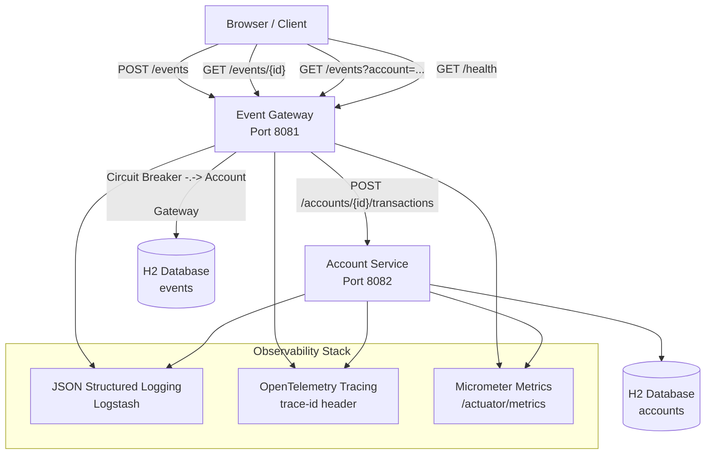
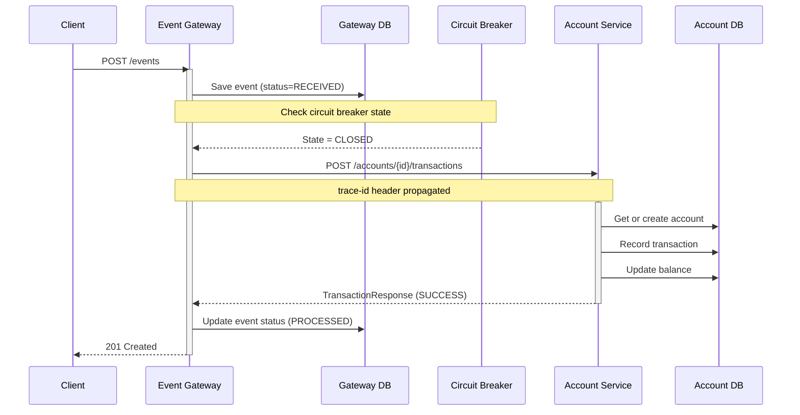
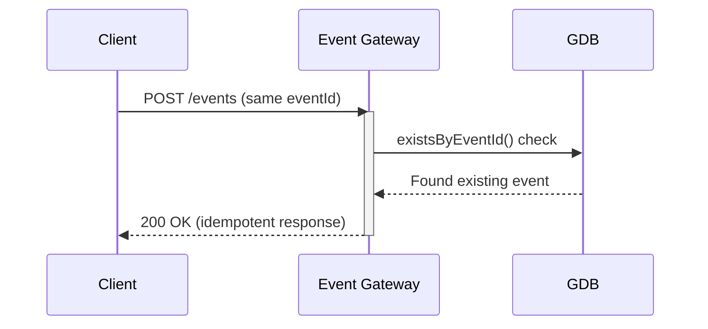
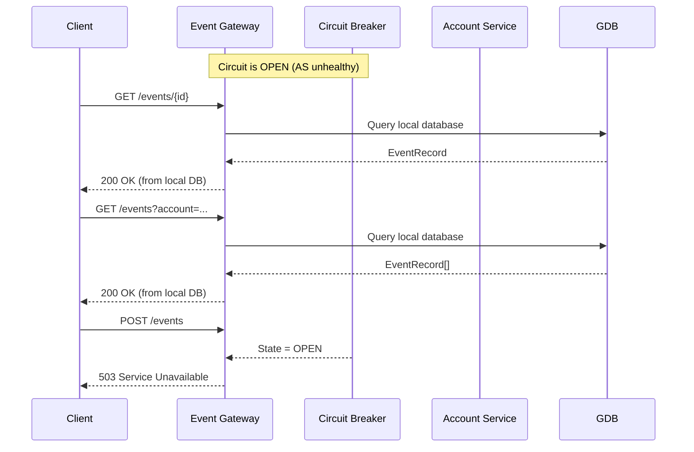
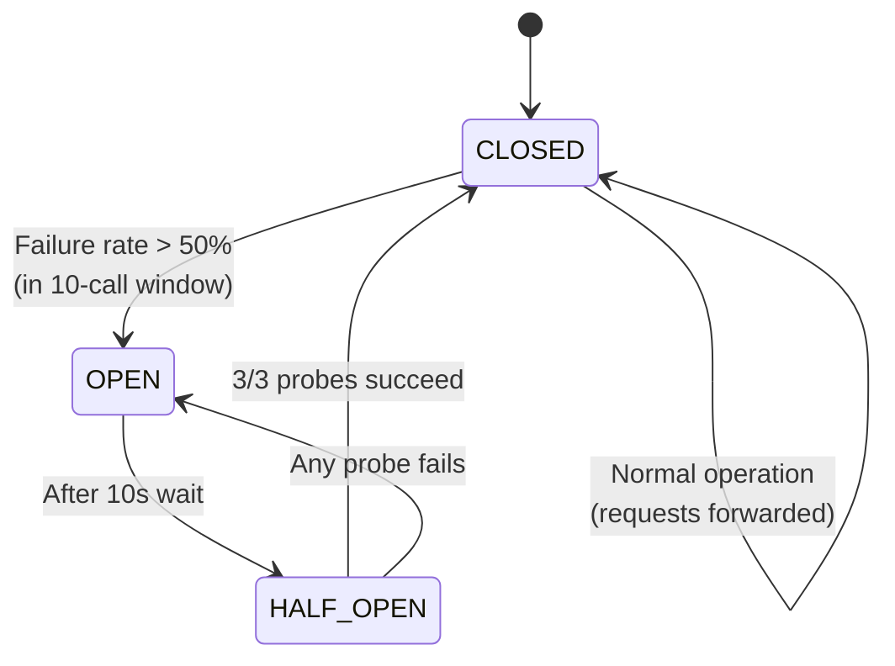

# Architecture Diagrams

## System Architecture



**Component responsibilities:**

- **Client:** Any HTTP client (curl, browser, application) submitting financial events
- **Event Gateway:** Public API endpoint; validates input, enforces idempotency, persists events locally, forwards to Account Service via RestClient
- **Account Service:** Internal service; manages account lifecycle, applies transactions, maintains balances
- **H2 Databases:** Each service has an isolated in-memory database with no shared state

## Event Flow

### Successful Event Submission



### Duplicate Event Submission



### Circuit Breaker Open — Read Operations Still Work



## Circuit Breaker States



**State transitions explained:**

- **CLOSED:** Normal operation. Requests flow through to Account Service. Failures are counted.
- **OPEN:** Requests are rejected immediately without calling Account Service. The 10-second wait allows the downstream to recover.
- **HALF_OPEN:** A limited number of test requests (3) are allowed through. If they succeed, the breaker closes; if any fail, it opens again.

## Graceful Degradation Flowchart

```mermaid
flowchart TD
    A[Client Request] --> B{Endpoint type?}

    B -->|POST /events| C{Circuit Breaker state?}
    B -->|GET /events/{id}| D[Query Gateway local DB]
    B -->|GET /events?account=| D
    B -->|GET /health| E[Return aggregated status]

    C -->|CLOSED| F[Forward to Account Service]
    C -->|OPEN| G[Return 503 with error body]

    F -->|Success| H[Return 201 Created<br/>with TransactionResponse]
    F -->|Failure| I[Mark event FAILED in DB<br/>Return 503 with error body]

    D --> J[Return events from gateway local DB]
    E --> K[Include account-service status<br/>in health response]
```

**Design principles illustrated:**

1. **Local-first reads:** All GET endpoints query the Gateway's local H2 database. They never depend on Account Service availability.
2. **Degraded writes:** POST /events requires Account Service. If unavailable (circuit open or call failure), the client receives a clear 503 with trace ID for debugging.
3. **Failure visibility:** The health endpoint reports Account Service status so monitoring tools can detect partial outages.
