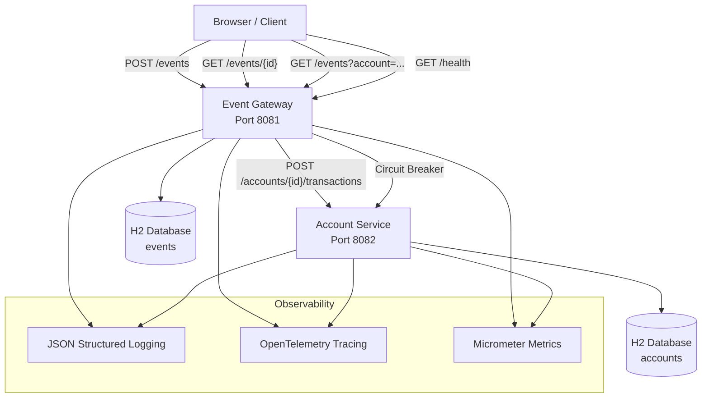
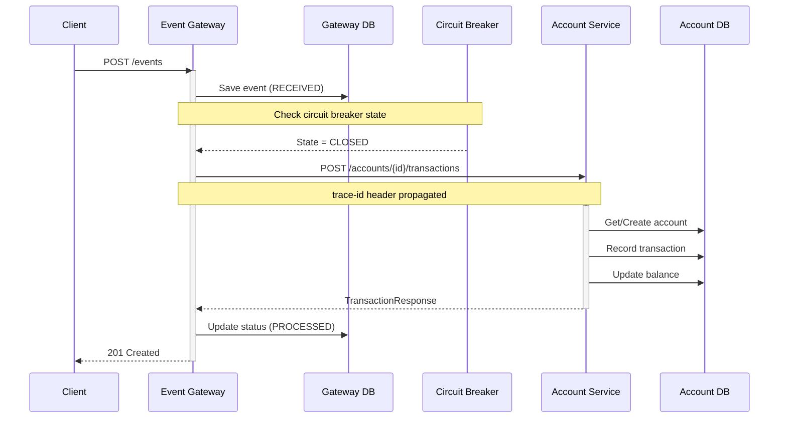
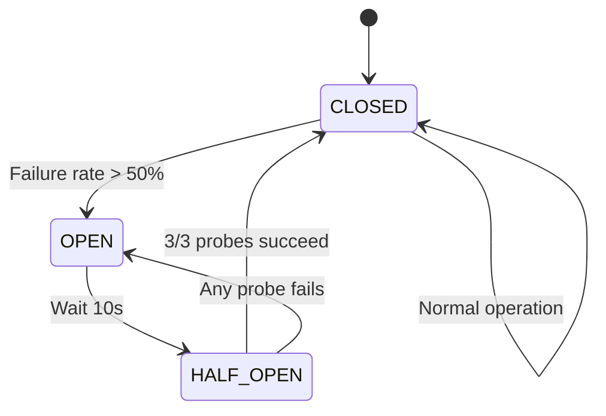

# Event Ledger Implementation Plan

> **For agentic workers:** REQUIRED SUB-SKILL: superpowers:subagent-driven-development to implement this plan task-by-task. Steps use checkbox (`- [ ]`) syntax for tracking.

**Goal:** Build a two-microservice Event Ledger system in Java/Spring Boot that processes financial transaction events with idempotency, out-of-order tolerance, distributed tracing, observability, and circuit breaker resiliency.

**Architecture:** Event Gateway (public-facing) receives transaction events, validates, enforces idempotency, and forwards to Account Service (internal). Both services run independently with H2 in-memory databases. OpenTelemetry traces propagate across the Gateway → Account call. Resilience4j circuit breaker protects the Gateway's downstream call.

**Tech Stack:** Java 26, Spring Boot 3.x, H2, Resilience4j, OpenTelemetry, Maven, JUnit 5, Docker Compose, Logback JSON, Virtual Threads

## Global Constraints

- Java 26 with virtual threads enabled for request handling
- Each service has its own H2 in-memory database (no shared state)
- Synchronous REST communication between services
- OpenTelemetry for distributed tracing with trace ID propagation via HTTP headers
- Resilience4j circuit breaker on Gateway → Account call
- JSON structured logging with trace IDs in every log entry
- Maven multi-module project structure
- Docker Compose to run both services
- Meaningful commit history reflecting working process
- No "superpowers" in code, folder names, or commit messages

---
## File Structure

```
event-ledger/
├── pom.xml                          # Parent POM
├── shared-models/                   # Shared DTOs/enums
│   ├── pom.xml
│   └── src/main/java/com/eventledger/shared/
│       ├── EventType.java
│       ├── TransactionRequest.java
│       ├── TransactionResponse.java
│       └── AccountDetails.java
├── account-service/                 # Internal account management
│   ├── pom.xml
│   ├── Dockerfile
│   └── src/
│       ├── main/java/com/eventledger/account/
│       │   ├── AccountServiceApplication.java
│       │   ├── config/
│       │   │   ├── OpenTelemetryConfig.java
│       │   │   ├── LoggingConfig.java
│       │   │   └── VirtualThreadConfig.java
│       │   ├── controller/
│       │   │   ├── AccountController.java
│       │   │   └── HealthController.java
│       │   ├── entity/
│       │   │   ├── Account.java
│       │   │   └── TransactionEntity.java
│       │   ├── repository/
│       │   │   ├── AccountRepository.java
│       │   │   └── TransactionRepository.java
│       │   ├── service/
│       │   │   └── AccountService.java
│       │   └── filter/
│       │       └── TracingFilter.java
│       └── main/resources/
│           └── application.yml
├── event-gateway/                   # Public-facing event API
│   ├── pom.xml
│   ├── Dockerfile
│   └── src/
│       ├── main/java/com/eventledger/gateway/
│       │   ├── EventGatewayApplication.java
│       │   ├── config/
│       │   │   ├── OpenTelemetryConfig.java
│       │   │   ├── CircuitBreakerConfig.java
│       │   │   ├── RestClientConfig.java
│       │   │   ├── LoggingConfig.java
│       │   │   └── VirtualThreadConfig.java
│       │   ├── controller/
│       │   │   ├── EventController.java
│       │   │   └── HealthController.java
│       │   ├── entity/
│       │   │   └── EventRecord.java
│       │   ├── repository/
│       │   │   └── EventRepository.java
│       │   ├── service/
│       │   │   └── EventService.java
│       │   ├── client/
│       │   │   └── AccountServiceClient.java
│       │   └── filter/
│       │       └── TracingFilter.java
│       └── main/resources/
│           └── application.yml
├── docker-compose.yml
├── .gitignore
├── README.md
└── docs/
    ├── design.md                    # Design document
    └── architecture.md              # Architecture diagrams (Mermaid)
```

---

### Task 1: Project Scaffolding & Shared Models

**Files:**
- Create: `event-ledger/pom.xml`
- Create: `event-ledger/shared-models/pom.xml`
- Create: `event-ledger/shared-models/src/main/java/com/eventledger/shared/EventType.java`
- Create: `event-ledger/shared-models/src/main/java/com/eventledger/shared/TransactionRequest.java`
- Create: `event-ledger/shared-models/src/main/java/com/eventledger/shared/TransactionResponse.java`
- Create: `event-ledger/shared-models/src/main/java/com/eventledger/shared/AccountDetails.java`
- Create: `event-ledger/.gitignore`
- Create: `event-ledger/account-service/pom.xml`
- Create: `event-ledger/event-gateway/pom.xml`

**Interfaces:**
- Produces: `EventType` enum (CREDIT, DEBIT)
- Produces: `TransactionRequest` record (eventId, accountId, type, amount, currency, eventTimestamp, metadata)
- Produces: `TransactionResponse` record (transactionId, accountId, newBalance, status, message)
- Produces: `AccountDetails` record (accountId, balance, currency, lastUpdated, transactionCount)
- Produces: Parent POM managing Spring Boot 3.4.x, Spring Cloud, Resilience4j, OpenTelemetry versions

- [ ] **Step 1: Create parent POM**

```xml
<?xml version="1.0" encoding="UTF-8"?>
<project xmlns="http://maven.apache.org/POM/4.0.0"
         xmlns:xsi="http://www.w3.org/2001/XMLSchema-instance"
         xsi:schemaLocation="http://maven.apache.org/POM/4.0.0 https://maven.apache.org/xsd/maven-4.0.0.xsd">
    <modelVersion>4.0.0</modelVersion>
    <groupId>com.eventledger</groupId>
    <artifactId>event-ledger</artifactId>
    <version>1.0.0</version>
    <packaging>pom</packaging>
    <name>Event Ledger</name>

    <modules>
        <module>shared-models</module>
        <module>account-service</module>
        <module>event-gateway</module>
    </modules>

    <parent>
        <groupId>org.springframework.boot</groupId>
        <artifactId>spring-boot-starter-parent</artifactId>
        <version>3.4.4</version>
        <relativePath/>
    </parent>

    <properties>
        <java.version>26</java.version>
        <maven.compiler.release>26</maven.compiler.release>
        <project.build.sourceEncoding>UTF-8</project.build.sourceEncoding>
        <spring-cloud.version>2024.0.1</spring-cloud.version>
        <resilience4j.version>2.2.0</resilience4j.version>
        <opentelemetry.version>1.46.0</opentelemetry.version>
        <logback-json.version>0.1.5</logback-json.version>
    </properties>

    <dependencyManagement>
        <dependencies>
            <dependency>
                <groupId>org.springframework.cloud</groupId>
                <artifactId>spring-cloud-dependencies</artifactId>
                <version>${spring-cloud.version}</version>
                <type>pom</type>
                <scope>import</scope>
            </dependency>
            <dependency>
                <groupId>io.micrometer</groupId>
                <artifactId>micrometer-tracing-bridge-otel</artifactId>
            </dependency>
            <dependency>
                <groupId>io.opentelemetry</groupId>
                <artifactId>opentelemetry-api</artifactId>
                <version>${opentelemetry.version}</version>
            </dependency>
            <dependency>
                <groupId>io.github.resilience4j</groupId>
                <artifactId>resilience4j-spring-boot3</artifactId>
                <version>${resilience4j.version}</version>
            </dependency>
            <dependency>
                <groupId>io.github.resilience4j</groupId>
                <artifactId>resilience4j-circuitbreaker</artifactId>
                <version>${resilience4j.version}</version>
            </dependency>
        </dependencies>
    </dependencyManagement>

    <dependencies>
        <dependency>
            <groupId>org.projectlombok</groupId>
            <artifactId>lombok</artifactId>
            <optional>true</optional>
        </dependency>
    </dependencies>

    <build>
        <plugins>
            <plugin>
                <groupId>org.springframework.boot</groupId>
                <artifactId>spring-boot-maven-plugin</artifactId>
                <configuration>
                    <excludes>
                        <exclude>
                            <groupId>org.projectlombok</groupId>
                            <artifactId>lombok</artifactId>
                        </exclude>
                    </excludes>
                </configuration>
            </plugin>
            <plugin>
                <groupId>org.apache.maven.plugins</groupId>
                <artifactId>maven-compiler-plugin</artifactId>
                <configuration>
                    <release>26</release>
                    <compilerArgs>
                        <arg>--enable-preview</arg>
                    </compilerArgs>
                </configuration>
            </plugin>
        </plugins>
    </build>
</project>
```

- [ ] **Step 2: Create shared-models POM**

```xml
<?xml version="1.0" encoding="UTF-8"?>
<project xmlns="http://maven.apache.org/POM/4.0.0"
         xmlns:xsi="http://www.w3.org/2001/XMLSchema-instance"
         xsi:schemaLocation="http://maven.apache.org/POM/4.0.0 https://maven.apache.org/xsd/maven-4.0.0.xsd">
    <modelVersion>4.0.0</modelVersion>
    <parent>
        <groupId>com.eventledger</groupId>
        <artifactId>event-ledger</artifactId>
        <version>1.0.0</version>
    </parent>
    <artifactId>shared-models</artifactId>
    <name>Shared Models</name>
    <dependencies>
        <dependency>
            <groupId>com.fasterxml.jackson.core</groupId>
            <artifactId>jackson-annotations</artifactId>
        </dependency>
        <dependency>
            <groupId>jakarta.validation</groupId>
            <artifactId>jakarta.validation-api</artifactId>
        </dependency>
    </dependencies>
</project>
```

- [ ] **Step 3: Create EventType enum**

```java
package com.eventledger.shared;

public enum EventType {
    CREDIT,
    DEBIT
}
```

- [ ] **Step 4: Create TransactionRequest**

```java
package com.eventledger.shared;

import jakarta.validation.constraints.NotBlank;
import jakarta.validation.constraints.NotNull;
import jakarta.validation.constraints.Positive;
import java.math.BigDecimal;
import java.time.Instant;
import java.util.Map;

public record TransactionRequest(
    @NotBlank String eventId,
    @NotBlank String accountId,
    @NotNull EventType type,
    @Positive @NotNull BigDecimal amount,
    @NotBlank String currency,
    @NotNull Instant eventTimestamp,
    Map<String, String> metadata
) {}
```

- [ ] **Step 5: Create TransactionResponse**

```java
package com.eventledger.shared;

import java.math.BigDecimal;
import java.time.Instant;

public record TransactionResponse(
    String transactionId,
    String accountId,
    BigDecimal newBalance,
    String currency,
    String status,
    String message,
    Instant processedAt
) {
    public static TransactionResponse success(String txId, String acctId, BigDecimal balance, String currency) {
        return new TransactionResponse(txId, acctId, balance, currency, "SUCCESS", null, Instant.now());
    }

    public static TransactionResponse error(String acctId, String message) {
        return new TransactionResponse(null, acctId, BigDecimal.ZERO, "USD", "ERROR", message, Instant.now());
    }
}
```

- [ ] **Step 6: Create AccountDetails**

```java
package com.eventledger.shared;

import java.math.BigDecimal;
import java.time.Instant;

public record AccountDetails(
    String accountId,
    BigDecimal balance,
    String currency,
    Instant lastUpdated,
    int transactionCount
) {}
```

- [ ] **Step 7: Create .gitignore**

```
target/
*.class
*.jar
*.log
.idea/
.vscode/
*.iml
.DS_Store
```

- [ ] **Step 8: Create account-service POM**

```xml
<?xml version="1.0" encoding="UTF-8"?>
<project xmlns="http://maven.apache.org/POM/4.0.0"
         xmlns:xsi="http://www.w3.org/2001/XMLSchema-instance"
         xsi:schemaLocation="http://maven.apache.org/POM/4.0.0 https://maven.apache.org/xsd/maven-4.0.0.xsd">
    <modelVersion>4.0.0</modelVersion>
    <parent>
        <groupId>com.eventledger</groupId>
        <artifactId>event-ledger</artifactId>
        <version>1.0.0</version>
    </parent>
    <artifactId>account-service</artifactId>
    <name>Account Service</name>

    <dependencies>
        <dependency>
            <groupId>com.eventledger</groupId>
            <artifactId>shared-models</artifactId>
            <version>${project.version}</version>
        </dependency>
        <dependency>
            <groupId>org.springframework.boot</groupId>
            <artifactId>spring-boot-starter-web</artifactId>
        </dependency>
        <dependency>
            <groupId>org.springframework.boot</groupId>
            <artifactId>spring-boot-starter-data-jpa</artifactId>
        </dependency>
        <dependency>
            <groupId>com.h2database</groupId>
            <artifactId>h2</artifactId>
            <scope>runtime</scope>
        </dependency>
        <dependency>
            <groupId>org.springframework.boot</groupId>
            <artifactId>spring-boot-starter-actuator</artifactId>
        </dependency>
        <dependency>
            <groupId>io.micrometer</groupId>
            <artifactId>micrometer-tracing-bridge-otel</artifactId>
        </dependency>
        <dependency>
            <groupId>io.opentelemetry</groupId>
            <artifactId>opentelemetry-exporter-logging</artifactId>
        </dependency>
        <dependency>
            <groupId>net.logstash.logback</groupId>
            <artifactId>logstash-logback-encoder</artifactId>
            <version>8.1</version>
        </dependency>
        <!-- Test -->
        <dependency>
            <groupId>org.springframework.boot</groupId>
            <artifactId>spring-boot-starter-test</artifactId>
            <scope>test</scope>
        </dependency>
    </dependencies>
</project>
```

- [ ] **Step 9: Create event-gateway POM**

```xml
<?xml version="1.0" encoding="UTF-8"?>
<project xmlns="http://maven.apache.org/POM/4.0.0"
         xmlns:xsi="http://www.w3.org/2001/XMLSchema-instance"
         xsi:schemaLocation="http://maven.apache.org/POM/4.0.0 https://maven.apache.org/xsd/maven-4.0.0.xsd">
    <modelVersion>4.0.0</modelVersion>
    <parent>
        <groupId>com.eventledger</groupId>
        <artifactId>event-ledger</artifactId>
        <version>1.0.0</version>
    </parent>
    <artifactId>event-gateway</artifactId>
    <name>Event Gateway</name>

    <dependencies>
        <dependency>
            <groupId>com.eventledger</groupId>
            <artifactId>shared-models</artifactId>
            <version>${project.version}</version>
        </dependency>
        <dependency>
            <groupId>org.springframework.boot</groupId>
            <artifactId>spring-boot-starter-web</artifactId>
        </dependency>
        <dependency>
            <groupId>org.springframework.boot</groupId>
            <artifactId>spring-boot-starter-data-jpa</artifactId>
        </dependency>
        <dependency>
            <groupId>com.h2database</groupId>
            <artifactId>h2</artifactId>
            <scope>runtime</scope>
        </dependency>
        <dependency>
            <groupId>org.springframework.boot</groupId>
            <artifactId>spring-boot-starter-actuator</artifactId>
        </dependency>
        <dependency>
            <groupId>io.micrometer</groupId>
            <artifactId>micrometer-tracing-bridge-otel</artifactId>
        </dependency>
        <dependency>
            <groupId>io.opentelemetry</groupId>
            <artifactId>opentelemetry-exporter-logging</artifactId>
        </dependency>
        <dependency>
            <groupId>io.github.resilience4j</groupId>
            <artifactId>resilience4j-spring-boot3</artifactId>
        </dependency>
        <dependency>
            <groupId>io.github.resilience4j</groupId>
            <artifactId>resilience4j-circuitbreaker</artifactId>
        </dependency>
        <dependency>
            <groupId>net.logstash.logback</groupId>
            <artifactId>logstash-logback-encoder</artifactId>
            <version>8.1</version>
        </dependency>
        <!-- Test -->
        <dependency>
            <groupId>org.springframework.boot</groupId>
            <artifactId>spring-boot-starter-test</artifactId>
            <scope>test</scope>
        </dependency>
        <dependency>
            <groupId>com.squareup.okhttp3</groupId>
            <artifactId>mockwebserver</artifactId>
            <version>4.12.0</version>
            <scope>test</scope>
        </dependency>
        <dependency>
            <groupId>io.github.resilience4j</groupId>
            <artifactId>resilience4j-test</artifactId>
            <version>${resilience4j.version}</version>
            <scope>test</scope>
        </dependency>
    </dependencies>
</project>
```

- [ ] **Step 10: Verify build compiles shared-models**

Run: `cd event-ledger && mvn compile -pl shared-models`
Expected: BUILD SUCCESS

- [ ] **Step 11: Initialize git repo and commit**

```bash
cd /home/appusai/Documents/Projects/Agiletal/event-ledger
git init
git add pom.xml shared-models/ account-service/pom.xml event-gateway/pom.xml .gitignore
git commit -m "chore: initial project structure with multi-module Maven setup

Set up parent POM with Spring Boot 3.4.x, shared-models module with
event types and DTOs, and module stubs for account-service and event-gateway.
Configured dependency management for Resilience4j and OpenTelemetry."
```

---

### Task 2: Account Service - Core Implementation

**Files:**
- Create: `account-service/src/main/java/com/eventledger/account/AccountServiceApplication.java`
- Create: `account-service/src/main/java/com/eventledger/account/entity/Account.java`
- Create: `account-service/src/main/java/com/eventledger/account/entity/TransactionEntity.java`
- Create: `account-service/src/main/java/com/eventledger/account/repository/AccountRepository.java`
- Create: `account-service/src/main/java/com/eventledger/account/repository/TransactionRepository.java`
- Create: `account-service/src/main/java/com/eventledger/account/service/AccountService.java`
- Create: `account-service/src/main/java/com/eventledger/account/controller/AccountController.java`
- Create: `account-service/src/main/java/com/eventledger/account/controller/HealthController.java`
- Create: `account-service/src/main/java/com/eventledger/account/config/VirtualThreadConfig.java`
- Create: `account-service/src/main/resources/application.yml`

**Interfaces:**
- Consumes: `TransactionRequest`, `TransactionResponse`, `AccountDetails`, `EventType` from shared-models
- Produces: `POST /accounts/{accountId}/transactions` → TransactionResponse
- Produces: `GET /accounts/{accountId}/balance` → AccountDetails
- Produces: `GET /accounts/{accountId}` → AccountDetails
- Produces: `GET /health` → health status JSON

- [ ] **Step 1: Create AccountServiceApplication.java**

```java
package com.eventledger.account;

import org.springframework.boot.SpringApplication;
import org.springframework.boot.autoconfigure.SpringBootApplication;

@SpringBootApplication
public class AccountServiceApplication {
    public static void main(String[] args) {
        SpringApplication.run(AccountServiceApplication.class, args);
    }
}
```

- [ ] **Step 2: Create VirtualThreadConfig.java**

```java
package com.eventledger.account.config;

import org.springframework.boot.web.embedded.tomcat.TomcatProtocolHandlerCustomizer;
import org.springframework.context.annotation.Bean;
import org.springframework.context.annotation.Configuration;
import java.util.concurrent.Executors;

@Configuration
public class VirtualThreadConfig {
    @Bean
    public TomcatProtocolHandlerCustomizer<?> protocolHandlerCustomizer() {
        return handler -> handler.setExecutor(Executors.newVirtualThreadPerTaskExecutor());
    }
}
```

- [ ] **Step 3: Create Account entity**

```java
package com.eventledger.account.entity;

import jakarta.persistence.*;
import java.math.BigDecimal;
import java.time.Instant;

@Entity
@Table(name = "accounts")
public class Account {
    @Id
    private String accountId;
    private BigDecimal balance;
    private String currency;
    private Instant lastUpdated;
    private int transactionCount;

    public Account() {}

    public Account(String accountId, String currency) {
        this.accountId = accountId;
        this.balance = BigDecimal.ZERO;
        this.currency = currency;
        this.lastUpdated = Instant.now();
        this.transactionCount = 0;
    }

    // Getters and setters
    public String getAccountId() { return accountId; }
    public void setAccountId(String accountId) { this.accountId = accountId; }
    public BigDecimal getBalance() { return balance; }
    public void setBalance(BigDecimal balance) { this.balance = balance; }
    public String getCurrency() { return currency; }
    public void setCurrency(String currency) { this.currency = currency; }
    public Instant getLastUpdated() { return lastUpdated; }
    public void setLastUpdated(Instant lastUpdated) { this.lastUpdated = lastUpdated; }
    public int getTransactionCount() { return transactionCount; }
    public void setTransactionCount(int transactionCount) { this.transactionCount = transactionCount; }
}
```

- [ ] **Step 4: Create TransactionEntity**

```java
package com.eventledger.account.entity;

import com.eventledger.shared.EventType;
import jakarta.persistence.*;
import java.math.BigDecimal;
import java.time.Instant;

@Entity
@Table(name = "transactions")
public class TransactionEntity {
    @Id
    private String eventId;
    private String accountId;
    @Enumerated(EnumType.STRING)
    private EventType type;
    private BigDecimal amount;
    private String currency;
    private Instant eventTimestamp;
    private Instant processedAt;
    @Column(length = 2000)
    private String metadata; // JSON string

    public TransactionEntity() {}

    // Getters and setters
    public String getEventId() { return eventId; }
    public void setEventId(String eventId) { this.eventId = eventId; }
    public String getAccountId() { return accountId; }
    public void setAccountId(String accountId) { this.accountId = accountId; }
    public EventType getType() { return type; }
    public void setType(EventType type) { this.type = type; }
    public BigDecimal getAmount() { return amount; }
    public void setAmount(BigDecimal amount) { this.amount = amount; }
    public String getCurrency() { return currency; }
    public void setCurrency(String currency) { this.currency = currency; }
    public Instant getEventTimestamp() { return eventTimestamp; }
    public void setEventTimestamp(Instant eventTimestamp) { this.eventTimestamp = eventTimestamp; }
    public Instant getProcessedAt() { return processedAt; }
    public void setProcessedAt(Instant processedAt) { this.processedAt = processedAt; }
    public String getMetadata() { return metadata; }
    public void setMetadata(String metadata) { this.metadata = metadata; }
}
```

- [ ] **Step 5: Create AccountRepository**

```java
package com.eventledger.account.repository;

import com.eventledger.account.entity.Account;
import org.springframework.data.jpa.repository.JpaRepository;

public interface AccountRepository extends JpaRepository<Account, String> {
}
```

- [ ] **Step 6: Create TransactionRepository**

```java
package com.eventledger.account.repository;

import com.eventledger.account.entity.TransactionEntity;
import org.springframework.data.jpa.repository.JpaRepository;
import java.util.List;

public interface TransactionRepository extends JpaRepository<TransactionEntity, String> {
    List<TransactionEntity> findByAccountIdOrderByEventTimestampAsc(String accountId);
    List<TransactionEntity> findByAccountId(String accountId);
    boolean existsByEventId(String eventId);
}
```

- [ ] **Step 7: Create AccountService**

```java
package com.eventledger.account.service;

import com.eventledger.account.entity.Account;
import com.eventledger.account.entity.TransactionEntity;
import com.eventledger.account.repository.AccountRepository;
import com.eventledger.account.repository.TransactionRepository;
import com.eventledger.shared.*;
import com.fasterxml.jackson.core.JsonProcessingException;
import com.fasterxml.jackson.databind.ObjectMapper;
import org.slf4j.Logger;
import org.slf4j.LoggerFactory;
import org.springframework.stereotype.Service;
import org.springframework.transaction.annotation.Transactional;

import java.math.BigDecimal;
import java.time.Instant;
import java.util.Map;
import java.util.Optional;

@Service
public class AccountService {
    private static final Logger log = LoggerFactory.getLogger(AccountService.class);
    private final AccountRepository accountRepository;
    private final TransactionRepository transactionRepository;
    private final ObjectMapper objectMapper;

    public AccountService(AccountRepository accountRepository,
                          TransactionRepository transactionRepository,
                          ObjectMapper objectMapper) {
        this.accountRepository = accountRepository;
        this.transactionRepository = transactionRepository;
        this.objectMapper = objectMapper;
    }

    @Transactional
    public TransactionResponse applyTransaction(TransactionRequest request) {
        // Idempotency check - if event already processed, return existing result
        if (transactionRepository.existsByEventId(request.eventId())) {
            log.info("Duplicate event detected: {}", request.eventId());
            Account account = accountRepository.findById(request.accountId()).orElse(null);
            if (account != null) {
                return TransactionResponse.success(
                    request.eventId(), request.accountId(), account.getBalance(), account.getCurrency());
            }
            return TransactionResponse.error(request.accountId(), "Account not found");
        }

        // Get or create account
        Account account = accountRepository.findById(request.accountId())
            .orElseGet(() -> {
                Account newAccount = new Account(request.accountId(), request.currency());
                log.info("Created new account: {}", request.accountId());
                return accountRepository.save(newAccount);
            });

        // Calculate new balance
        BigDecimal amount = request.amount();
        BigDecimal newBalance = switch (request.type()) {
            case CREDIT -> account.getBalance().add(amount);
            case DEBIT -> account.getBalance().subtract(amount);
        };

        // Update account
        account.setBalance(newBalance);
        account.setCurrency(request.currency());
        account.setLastUpdated(Instant.now());
        account.setTransactionCount(account.getTransactionCount() + 1);
        accountRepository.save(account);

        // Record transaction
        TransactionEntity tx = new TransactionEntity();
        tx.setEventId(request.eventId());
        tx.setAccountId(request.accountId());
        tx.setType(request.type());
        tx.setAmount(amount);
        tx.setCurrency(request.currency());
        tx.setEventTimestamp(request.eventTimestamp());
        tx.setProcessedAt(Instant.now());
        if (request.metadata() != null && !request.metadata().isEmpty()) {
            try {
                tx.setMetadata(objectMapper.writeValueAsString(request.metadata()));
            } catch (JsonProcessingException e) {
                log.warn("Failed to serialize metadata for event {}", request.eventId(), e);
            }
        }
        transactionRepository.save(tx);

        log.info("Applied {} {} to account {}: new balance={}",
            request.type(), amount, request.accountId(), newBalance);

        return TransactionResponse.success(
            request.eventId(), request.accountId(), newBalance, account.getCurrency());
    }

    public AccountDetails getAccountDetails(String accountId) {
        Account account = accountRepository.findById(accountId)
            .orElseThrow(() -> new IllegalArgumentException("Account not found: " + accountId));
        return new AccountDetails(
            account.getAccountId(),
            account.getBalance(),
            account.getCurrency(),
            account.getLastUpdated(),
            account.getTransactionCount()
        );
    }

    public BigDecimal getBalance(String accountId) {
        Account account = accountRepository.findById(accountId)
            .orElseThrow(() -> new IllegalArgumentException("Account not found: " + accountId));
        return account.getBalance();
    }
}
```

- [ ] **Step 8: Create AccountController**

```java
package com.eventledger.account.controller;

import com.eventledger.account.service.AccountService;
import com.eventledger.shared.AccountDetails;
import com.eventledger.shared.TransactionRequest;
import com.eventledger.shared.TransactionResponse;
import jakarta.validation.Valid;
import org.slf4j.Logger;
import org.slf4j.LoggerFactory;
import org.springframework.http.HttpStatus;
import org.springframework.http.ResponseEntity;
import org.springframework.web.bind.annotation.*;

import java.math.BigDecimal;
import java.util.Map;

@RestController
@RequestMapping("/accounts")
public class AccountController {
    private static final Logger log = LoggerFactory.getLogger(AccountController.class);
    private final AccountService accountService;

    public AccountController(AccountService accountService) {
        this.accountService = accountService;
    }

    @PostMapping("/{accountId}/transactions")
    public ResponseEntity<TransactionResponse> applyTransaction(
            @PathVariable String accountId,
            @Valid @RequestBody TransactionRequest request) {
        if (!accountId.equals(request.accountId())) {
            return ResponseEntity.badRequest().body(
                TransactionResponse.error(accountId, "Path accountId does not match request body"));
        }
        try {
            TransactionResponse response = accountService.applyTransaction(request);
            return ResponseEntity.ok(response);
        } catch (Exception e) {
            log.error("Failed to apply transaction: {}", e.getMessage(), e);
            return ResponseEntity.status(HttpStatus.INTERNAL_SERVER_ERROR)
                .body(TransactionResponse.error(accountId, e.getMessage()));
        }
    }

    @GetMapping("/{accountId}/balance")
    public ResponseEntity<Map<String, Object>> getBalance(@PathVariable String accountId) {
        try {
            BigDecimal balance = accountService.getBalance(accountId);
            return ResponseEntity.ok(Map.of(
                "accountId", accountId,
                "balance", balance,
                "currency", "USD"
            ));
        } catch (IllegalArgumentException e) {
            return ResponseEntity.status(HttpStatus.NOT_FOUND)
                .body(Map.of("error", e.getMessage()));
        }
    }

    @GetMapping("/{accountId}")
    public ResponseEntity<?> getAccountDetails(@PathVariable String accountId) {
        try {
            AccountDetails details = accountService.getAccountDetails(accountId);
            return ResponseEntity.ok(details);
        } catch (IllegalArgumentException e) {
            return ResponseEntity.status(HttpStatus.NOT_FOUND)
                .body(Map.of("error", e.getMessage()));
        }
    }
}
```

- [ ] **Step 9: Create HealthController**

```java
package com.eventledger.account.controller;

import org.springframework.http.ResponseEntity;
import org.springframework.web.bind.annotation.GetMapping;
import org.springframework.web.bind.annotation.RestController;

import javax.sql.DataSource;
import java.sql.Connection;
import java.time.Instant;
import java.util.Map;

@RestController
public class HealthController {
    private final DataSource dataSource;
    private final Instant startTime;

    public HealthController(DataSource dataSource) {
        this.dataSource = dataSource;
        this.startTime = Instant.now();
    }

    @GetMapping("/health")
    public ResponseEntity<Map<String, Object>> health() {
        String dbStatus = "UP";
        try (Connection conn = dataSource.getConnection()) {
            if (!conn.isValid(2)) {
                dbStatus = "DOWN";
            }
        } catch (Exception e) {
            dbStatus = "DOWN: " + e.getMessage();
        }

        boolean isHealthy = dbStatus.equals("UP");
        Map<String, Object> status = Map.of(
            "service", "account-service",
            "status", isHealthy ? "UP" : "DOWN",
            "database", dbStatus,
            "uptime", java.time.Duration.between(startTime, Instant.now()).toSeconds() + "s",
            "timestamp", Instant.now().toString()
        );

        return isHealthy ? ResponseEntity.ok(status)
                         : ResponseEntity.status(503).body(status);
    }
}
```

- [ ] **Step 10: Create application.yml**

```yaml
server:
  port: 8082
  tomcat:
    threads:
      max: 4  # Minimal for in-memory, virtual threads handle concurrency

spring:
  application:
    name: account-service
  datasource:
    url: jdbc:h2:mem:accounts;DB_CLOSE_DELAY=-1
    driver-class-name: org.h2.Driver
    username: sa
    password:
  jpa:
    hibernate:
      ddl-auto: create-drop
    show-sql: false
    properties:
      hibernate:
        format_sql: true

logging:
  level:
    com.eventledger: INFO

management:
  endpoints:
    web:
      exposure:
        include: health,metrics
```

- [ ] **Step 11: Verify build compiles**

Run: `cd event-ledger && mvn compile -pl account-service -am`
Expected: BUILD SUCCESS

- [ ] **Step 12: Commit**

```bash
git add account-service/src/
git commit -m "feat(account-service): core implementation with virtual threads

Implement Account Service with REST endpoints for transaction processing,
balance queries, and account details. Uses H2 in-memory database, JPA
entities, and virtual threads via Tomcat protocol handler customization.
Includes health check endpoint with database connectivity diagnostics."
```

---

### Task 3: Event Gateway - Core Implementation

**Files:**
- Create: `event-gateway/src/main/java/com/eventledger/gateway/EventGatewayApplication.java`
- Create: `event-gateway/src/main/java/com/eventledger/gateway/config/VirtualThreadConfig.java`
- Create: `event-gateway/src/main/java/com/eventledger/gateway/config/RestClientConfig.java`
- Create: `event-gateway/src/main/java/com/eventledger/gateway/config/CircuitBreakerConfig.java`
- Create: `event-gateway/src/main/java/com/eventledger/gateway/entity/EventRecord.java`
- Create: `event-gateway/src/main/java/com/eventledger/gateway/repository/EventRepository.java`
- Create: `event-gateway/src/main/java/com/eventledger/gateway/service/EventService.java`
- Create: `event-gateway/src/main/java/com/eventledger/gateway/client/AccountServiceClient.java`
- Create: `event-gateway/src/main/java/com/eventledger/gateway/controller/EventController.java`
- Create: `event-gateway/src/main/java/com/eventledger/gateway/controller/HealthController.java`
- Create: `event-gateway/src/main/resources/application.yml`

**Interfaces:**
- Consumes: `TransactionRequest`, `TransactionResponse`, `AccountDetails`, `EventType` from shared-models
- Consumes: Account Service REST endpoints at `http://localhost:8082`
- Produces: `POST /events`, `GET /events/{id}`, `GET /events?account={id}`, `GET /health`

- [ ] **Step 1: Create EventGatewayApplication.java**

```java
package com.eventledger.gateway;

import org.springframework.boot.SpringApplication;
import org.springframework.boot.autoconfigure.SpringBootApplication;

@SpringBootApplication
public class EventGatewayApplication {
    public static void main(String[] args) {
        SpringApplication.run(EventGatewayApplication.class, args);
    }
}
```

- [ ] **Step 2: Create VirtualThreadConfig (same pattern as account service)**

```java
package com.eventledger.gateway.config;

import org.springframework.boot.web.embedded.tomcat.TomcatProtocolHandlerCustomizer;
import org.springframework.context.annotation.Bean;
import org.springframework.context.annotation.Configuration;
import java.util.concurrent.Executors;

@Configuration
public class VirtualThreadConfig {
    @Bean
    public TomcatProtocolHandlerCustomizer<?> protocolHandlerCustomizer() {
        return handler -> handler.setExecutor(Executors.newVirtualThreadPerTaskExecutor());
    }
}
```

- [ ] **Step 3: Create RestClientConfig**

```java
package com.eventledger.gateway.config;

import org.springframework.context.annotation.Bean;
import org.springframework.context.annotation.Configuration;
import org.springframework.web.client.RestClient;
import org.springframework.web.client.support.RestClientAdapter;
import org.springframework.web.service.invoker.HttpServiceProxyFactory;

@Configuration
public class RestClientConfig {
    @Bean
    public RestClient.Builder restClientBuilder() {
        return RestClient.builder();
    }
}
```

- [ ] **Step 4: Create CircuitBreakerConfig**

```java
package com.eventledger.gateway.config;

import io.github.resilience4j.circuitbreaker.CircuitBreakerConfig.SlidingWindowType;
import io.github.resilience4j.circuitbreaker.CircuitBreakerRegistry;
import org.springframework.context.annotation.Bean;
import org.springframework.context.annotation.Configuration;
import org.springframework.context.annotation.Primary;

import java.time.Duration;

@Configuration
public class CircuitBreakerConfiguration {

    @Bean
    @Primary
    public CircuitBreakerRegistry circuitBreakerRegistry() {
        io.github.resilience4j.circuitbreaker.CircuitBreakerConfig config =
            io.github.resilience4j.circuitbreaker.CircuitBreakerConfig.custom()
                .slidingWindowType(SlidingWindowType.COUNT_BASED)
                .slidingWindowSize(10)
                .minimumNumberOfCalls(5)
                .failureRateThreshold(50.0f)
                .waitDurationInOpenState(Duration.ofSeconds(10))
                .permittedNumberOfCallsInHalfOpenState(3)
                .automaticTransitionFromOpenToHalfOpenEnabled(true)
                .build();

        return CircuitBreakerRegistry.of(config);
    }
}
```

- [ ] **Step 5: Create EventRecord entity**

```java
package com.eventledger.gateway.entity;

import com.eventledger.shared.EventType;
import jakarta.persistence.*;
import java.math.BigDecimal;
import java.time.Instant;

@Entity
@Table(name = "events")
public class EventRecord {
    @Id
    private String eventId;
    private String accountId;
    @Enumerated(EnumType.STRING)
    private EventType type;
    private BigDecimal amount;
    private String currency;
    private Instant eventTimestamp;
    private Instant receivedAt;
    private String status; // RECEIVED, PROCESSED, FAILED
    private String errorMessage;
    @Column(length = 2000)
    private String metadata;

    public EventRecord() {}

    // Getters and setters
    public String getEventId() { return eventId; }
    public void setEventId(String eventId) { this.eventId = eventId; }
    public String getAccountId() { return accountId; }
    public void setAccountId(String accountId) { this.accountId = accountId; }
    public EventType getType() { return type; }
    public void setType(EventType type) { this.type = type; }
    public BigDecimal getAmount() { return amount; }
    public void setAmount(BigDecimal amount) { this.amount = amount; }
    public String getCurrency() { return currency; }
    public void setCurrency(String currency) { this.currency = currency; }
    public Instant getEventTimestamp() { return eventTimestamp; }
    public void setEventTimestamp(Instant eventTimestamp) { this.eventTimestamp = eventTimestamp; }
    public Instant getReceivedAt() { return receivedAt; }
    public void setReceivedAt(Instant receivedAt) { this.receivedAt = receivedAt; }
    public String getStatus() { return status; }
    public void setStatus(String status) { this.status = status; }
    public String getErrorMessage() { return errorMessage; }
    public void setErrorMessage(String errorMessage) { this.errorMessage = errorMessage; }
    public String getMetadata() { return metadata; }
    public void setMetadata(String metadata) { this.metadata = metadata; }
}
```

- [ ] **Step 6: Create EventRepository**

```java
package com.eventledger.gateway.repository;

import com.eventledger.gateway.entity.EventRecord;
import org.springframework.data.jpa.repository.JpaRepository;
import java.util.List;

public interface EventRepository extends JpaRepository<EventRecord, String> {
    List<EventRecord> findByAccountIdOrderByEventTimestampAsc(String accountId);
    List<EventRecord> findByAccountId(String accountId);
    boolean existsByEventId(String eventId);
}
```

- [ ] **Step 7: Create AccountServiceClient**

```java
package com.eventledger.gateway.client;

import com.eventledger.shared.TransactionRequest;
import com.eventledger.shared.TransactionResponse;
import io.github.resilience4j.circuitbreaker.CircuitBreaker;
import io.github.resilience4j.circuitbreaker.CircuitBreakerRegistry;
import io.github.resilience4j.decorators.Decorators;
import org.slf4j.Logger;
import org.slf4j.LoggerFactory;
import org.springframework.beans.factory.annotation.Value;
import org.springframework.http.HttpEntity;
import org.springframework.http.HttpHeaders;
import org.springframework.http.MediaType;
import org.springframework.http.ResponseEntity;
import org.springframework.stereotype.Component;
import org.springframework.web.client.RestClient;

import java.util.function.Supplier;

@Component
public class AccountServiceClient {
    private static final Logger log = LoggerFactory.getLogger(AccountServiceClient.class);
    private final RestClient restClient;
    private final CircuitBreaker circuitBreaker;
    private final String accountServiceBaseUrl;

    public AccountServiceClient(RestClient.Builder restClientBuilder,
                                CircuitBreakerRegistry circuitBreakerRegistry,
                                @Value("${account-service.url}") String accountServiceUrl) {
        this.accountServiceBaseUrl = accountServiceUrl;
        this.restClient = restClientBuilder.baseUrl(accountServiceUrl).build();
        this.circuitBreaker = circuitBreakerRegistry.circuitBreaker("accountService");
    }

    public TransactionResponse applyTransaction(TransactionRequest request, String traceId) {
        Supplier<TransactionResponse> supplier = Decorators.ofSupplier(() -> {
            HttpHeaders headers = new HttpHeaders();
            headers.setContentType(MediaType.APPLICATION_JSON);
            headers.set("trace-id", traceId);

            String url = accountServiceBaseUrl + "/accounts/" + request.accountId() + "/transactions";
            HttpEntity<TransactionRequest> entity = new HttpEntity<>(request, headers);

            ResponseEntity<TransactionResponse> response = restClient.post()
                .uri("/accounts/{accountId}/transactions", request.accountId())
                .headers(h -> h.set("trace-id", traceId))
                .body(request)
                .retrieve()
                .toEntity(TransactionResponse.class);

            return response.getBody();
        }).withCircuitBreaker(circuitBreaker).decorate();

        try {
            return supplier.get();
        } catch (Exception e) {
            log.warn("Account Service call failed for event {}: {}", request.eventId(), e.getMessage());
            throw e;
        }
    }

    public boolean isCircuitBreakerOpen() {
        return circuitBreaker.getState() == CircuitBreaker.State.OPEN;
    }
}
```

- [ ] **Step 8: Create EventService**

```java
package com.eventledger.gateway.service;

import com.eventledger.gateway.client.AccountServiceClient;
import com.eventledger.gateway.entity.EventRecord;
import com.eventledger.gateway.repository.EventRepository;
import com.eventledger.shared.*;
import com.fasterxml.jackson.core.JsonProcessingException;
import com.fasterxml.jackson.databind.ObjectMapper;
import org.slf4j.Logger;
import org.slf4j.LoggerFactory;
import org.springframework.http.HttpStatus;
import org.springframework.stereotype.Service;
import org.springframework.transaction.annotation.Transactional;
import org.springframework.web.server.ResponseStatusException;

import java.time.Instant;
import java.util.*;
import java.util.stream.Collectors;

@Service
public class EventService {
    private static final Logger log = LoggerFactory.getLogger(EventService.class);
    private final EventRepository eventRepository;
    private final AccountServiceClient accountServiceClient;
    private final ObjectMapper objectMapper;

    public EventService(EventRepository eventRepository,
                        AccountServiceClient accountServiceClient,
                        ObjectMapper objectMapper) {
        this.eventRepository = eventRepository;
        this.accountServiceClient = accountServiceClient;
        this.objectMapper = objectMapper;
    }

    @Transactional
    public TransactionResponse submitEvent(TransactionRequest request, String traceId) {
        // Idempotency check
        Optional<EventRecord> existing = eventRepository.findById(request.eventId());
        if (existing.isPresent()) {
            log.info("Duplicate event received: {} (original status: {})", request.eventId(), existing.get().getStatus());
            if ("PROCESSED".equals(existing.get().getStatus())) {
                return TransactionResponse.success(
                    request.eventId(), request.accountId(), BigDecimal.ZERO, request.currency());
            }
            return TransactionResponse.success(
                request.eventId(), request.accountId(), BigDecimal.ZERO, request.currency());
        }

        // Save event as RECEIVED
        EventRecord event = new EventRecord();
        event.setEventId(request.eventId());
        event.setAccountId(request.accountId());
        event.setType(request.type());
        event.setAmount(request.amount());
        event.setCurrency(request.currency());
        event.setEventTimestamp(request.eventTimestamp());
        event.setReceivedAt(Instant.now());
        event.setStatus("RECEIVED");
        if (request.metadata() != null && !request.metadata().isEmpty()) {
            try {
                event.setMetadata(objectMapper.writeValueAsString(request.metadata()));
            } catch (JsonProcessingException e) {
                log.warn("Failed to serialize metadata", e);
            }
        }
        eventRepository.save(event);

        // Forward to Account Service
        try {
            TransactionResponse accountResponse = accountServiceClient.applyTransaction(request, traceId);
            event.setStatus("PROCESSED");
            eventRepository.save(event);
            log.info("Event {} processed successfully", request.eventId());
            return accountResponse;
        } catch (Exception e) {
            event.setStatus("FAILED");
            event.setErrorMessage(e.getMessage());
            eventRepository.save(event);
            log.error("Event {} failed to process: {}", request.eventId(), e.getMessage());
            throw new ResponseStatusException(HttpStatus.SERVICE_UNAVAILABLE,
                "Account Service unavailable: " + e.getMessage());
        }
    }

    public EventRecord getEvent(String eventId) {
        return eventRepository.findById(eventId)
            .orElseThrow(() -> new ResponseStatusException(HttpStatus.NOT_FOUND, "Event not found: " + eventId));
    }

    public List<EventRecord> getEventsByAccount(String accountId) {
        return eventRepository.findByAccountIdOrderByEventTimestampAsc(accountId);
    }

    public boolean isAccountServiceAvailable() {
        return !accountServiceClient.isCircuitBreakerOpen();
    }
}
```

- [ ] **Step 9: Create EventController**

```java
package com.eventledger.gateway.controller;

import com.eventledger.gateway.entity.EventRecord;
import com.eventledger.gateway.service.EventService;
import com.eventledger.shared.TransactionRequest;
import com.eventledger.shared.TransactionResponse;
import jakarta.validation.Valid;
import org.slf4j.Logger;
import org.slf4j.LoggerFactory;
import org.slf4j.MDC;
import org.springframework.http.HttpStatus;
import org.springframework.http.ResponseEntity;
import org.springframework.web.bind.annotation.*;

import java.util.List;
import java.util.Map;
import java.util.UUID;

@RestController
@RequestMapping("/events")
public class EventController {
    private static final Logger log = LoggerFactory.getLogger(EventController.class);
    private final EventService eventService;

    public EventController(EventService eventService) {
        this.eventService = eventService;
    }

    @PostMapping
    public ResponseEntity<?> submitEvent(@Valid @RequestBody TransactionRequest request) {
        String traceId = MDC.get("trace-id");
        if (traceId == null) {
            traceId = UUID.randomUUID().toString();
            MDC.put("trace-id", traceId);
        }

        // Check if account service is available first (circuit breaker check)
        if (!eventService.isAccountServiceAvailable()) {
            log.warn("Account Service is unavailable (circuit breaker open), rejecting event");
            return ResponseEntity.status(HttpStatus.SERVICE_UNAVAILABLE)
                .body(Map.of(
                    "error", "Account Service is temporarily unavailable. Please retry later.",
                    "traceId", traceId,
                    "eventId", request.eventId()
                ));
        }

        try {
            TransactionResponse response = eventService.submitEvent(request, traceId);
            boolean isDuplicate = request.eventId() != null &&
                eventService.getEvent(request.eventId()) != null;

            return isDuplicate
                ? ResponseEntity.status(HttpStatus.OK).body(response)
                : ResponseEntity.status(HttpStatus.CREATED).body(response);
        } catch (Exception e) {
            log.error("Failed to process event: {}", e.getMessage(), e);
            return ResponseEntity.status(HttpStatus.SERVICE_UNAVAILABLE)
                .body(Map.of(
                    "error", e.getMessage(),
                    "traceId", traceId,
                    "eventId", request.eventId()
                ));
        }
    }

    @GetMapping("/{eventId}")
    public ResponseEntity<?> getEvent(@PathVariable String eventId) {
        try {
            EventRecord event = eventService.getEvent(eventId);
            return ResponseEntity.ok(event);
        } catch (Exception e) {
            return ResponseEntity.status(HttpStatus.NOT_FOUND)
                .body(Map.of("error", e.getMessage()));
        }
    }

    @GetMapping
    public ResponseEntity<List<EventRecord>> getEventsByAccount(
            @RequestParam("account") String accountId) {
        List<EventRecord> events = eventService.getEventsByAccount(accountId);
        return ResponseEntity.ok(events);
    }
}
```

- [ ] **Step 10: Create HealthController**

```java
package com.eventledger.gateway.controller;

import com.eventledger.gateway.service.EventService;
import org.springframework.http.ResponseEntity;
import org.springframework.web.bind.annotation.GetMapping;
import org.springframework.web.bind.annotation.RestController;

import javax.sql.DataSource;
import java.sql.Connection;
import java.time.Duration;
import java.time.Instant;
import java.util.Map;

@RestController
public class HealthController {
    private final DataSource dataSource;
    private final EventService eventService;
    private final Instant startTime;

    public HealthController(DataSource dataSource, EventService eventService) {
        this.dataSource = dataSource;
        this.eventService = eventService;
        this.startTime = Instant.now();
    }

    @GetMapping("/health")
    public ResponseEntity<Map<String, Object>> health() {
        String dbStatus = "UP";
        try (Connection conn = dataSource.getConnection()) {
            if (!conn.isValid(2)) dbStatus = "DOWN";
        } catch (Exception e) {
            dbStatus = "DOWN: " + e.getMessage();
        }

        boolean isHealthy = "UP".equals(dbStatus);
        return isHealthy
            ? ResponseEntity.ok(Map.of(
                "service", "event-gateway",
                "status", "UP",
                "database", dbStatus,
                "accountService", eventService.isAccountServiceAvailable() ? "UP" : "CIRCUIT_OPEN",
                "uptime", Duration.between(startTime, Instant.now()).toSeconds() + "s",
                "timestamp", Instant.now().toString()))
            : ResponseEntity.status(503).body(Map.of(
                "service", "event-gateway",
                "status", "DOWN",
                "database", dbStatus));
    }
}
```

- [ ] **Step 11: Create application.yml**

```yaml
server:
  port: 8081
  tomcat:
    threads:
      max: 4

spring:
  application:
    name: event-gateway
  datasource:
    url: jdbc:h2:mem:events;DB_CLOSE_DELAY=-1
    driver-class-name: org.h2.Driver
    username: sa
    password:
  jpa:
    hibernate:
      ddl-auto: create-drop
    show-sql: false
    properties:
      hibernate:
        format_sql: true

account-service:
  url: http://localhost:8082

logging:
  level:
    com.eventledger: INFO

management:
  endpoints:
    web:
      exposure:
        include: health,metrics
```

- [ ] **Step 12: Verify build compiles both services**

Run: `cd event-ledger && mvn compile`
Expected: BUILD SUCCESS

- [ ] **Step 13: Commit**

```bash
git add event-gateway/src/
git commit -m "feat(event-gateway): core implementation with circuit breaker

Implement Event Gateway with REST endpoints for event submission, retrieval,
and account-based queries. Includes Resilience4j circuit breaker for Account
Service calls, idempotency via event ID deduplication, and virtual threads.
Graceful degradation returns 503 when Account Service is unavailable."
```

---

### Task 4: Observability - Distributed Tracing & Structured Logging

**Files:**
- Create: `account-service/src/main/java/com/eventledger/account/config/OpenTelemetryConfig.java`
- Create: `account-service/src/main/java/com/eventledger/account/config/LoggingConfig.java`
- Create: `account-service/src/main/java/com/eventledger/account/filter/TracingFilter.java`
- Create: `account-service/src/main/resources/logback-spring.xml`
- Create: `event-gateway/src/main/java/com/eventledger/gateway/config/OpenTelemetryConfig.java`
- Create: `event-gateway/src/main/java/com/eventledger/gateway/config/LoggingConfig.java`
- Create: `event-gateway/src/main/java/com/eventledger/gateway/filter/TracingFilter.java`
- Create: `event-gateway/src/main/resources/logback-spring.xml`
- Modify: `event-gateway/src/main/java/com/eventledger/gateway/client/AccountServiceClient.java` (add trace ID propagation)
- Modify: `event-gateway/src/main/java/com/eventledger/gateway/controller/EventController.java` (add custom metrics)

**Interfaces:**
- Trace ID propagated via HTTP header `trace-id`
- JSON structured logging with trace-id, service, timestamp, level, message
- Custom actuator metrics for request count by endpoint

- [ ] **Step 1: Create TracingFilter for Account Service**

```java
package com.eventledger.account.filter;

import jakarta.servlet.*;
import jakarta.servlet.http.HttpServletRequest;
import jakarta.servlet.http.HttpServletResponse;
import org.slf4j.MDC;
import org.springframework.core.annotation.Order;
import org.springframework.stereotype.Component;

import java.io.IOException;
import java.util.UUID;

@Component
@Order(1)
public class TracingFilter implements Filter {
    @Override
    public void doFilter(ServletRequest request, ServletResponse response,
                         FilterChain chain) throws IOException, ServletException {
        HttpServletRequest httpRequest = (HttpServletRequest) request;
        String traceId = httpRequest.getHeader("trace-id");
        if (traceId == null || traceId.isBlank()) {
            traceId = UUID.randomUUID().toString();
        }
        MDC.put("trace-id", traceId);
        MDC.put("service", "account-service");

        HttpServletResponse httpResponse = (HttpServletResponse) response;
        httpResponse.setHeader("trace-id", traceId);

        try {
            chain.doFilter(request, response);
        } finally {
            MDC.clear();
        }
    }
}
```

- [ ] **Step 2: Create OpenTelemetryConfig for Account Service**

```java
package com.eventledger.account.config;

import io.opentelemetry.api.OpenTelemetry;
import io.opentelemetry.api.trace.Tracer;
import io.opentelemetry.api.trace.propagation.W3CTraceContextPropagator;
import io.opentelemetry.context.propagation.ContextPropagators;
import io.opentelemetry.sdk.OpenTelemetrySdk;
import io.opentelemetry.sdk.trace.SdkTracerProvider;
import io.opentelemetry.sdk.trace.export.SimpleSpanProcessor;
import io.opentelemetry.exporter.logging.LoggingSpanExporter;
import org.springframework.context.annotation.Bean;
import org.springframework.context.annotation.Configuration;

@Configuration
public class OpenTelemetryConfig {
    @Bean
    public OpenTelemetry openTelemetry() {
        SdkTracerProvider tracerProvider = SdkTracerProvider.builder()
            .addSpanProcessor(SimpleSpanProcessor.create(new LoggingSpanExporter()))
            .build();
        return OpenTelemetrySdk.builder()
            .setTracerProvider(tracerProvider)
            .setPropagators(ContextPropagators.create(W3CTraceContextPropagator.getInstance()))
            .build();
    }

    @Bean
    public Tracer tracer(OpenTelemetry openTelemetry) {
        return openTelemetry.getTracer("account-service");
    }
}
```

- [ ] **Step 3: Create LoggingConfig for Account Service**

```java
package com.eventledger.account.config;

import jakarta.annotation.PostConstruct;
import org.slf4j.Logger;
import org.slf4j.LoggerFactory;
import org.springframework.context.annotation.Configuration;

@Configuration
public class LoggingConfig {
    private static final Logger log = LoggerFactory.getLogger(LoggingConfig.class);

    @PostConstruct
    public void init() {
        log.info("Logging configured for account-service with JSON format");
    }
}
```

- [ ] **Step 4: Create logback-spring.xml for Account Service**

```xml
<?xml version="1.0" encoding="UTF-8"?>
<configuration>
    <include resource="org/springframework/boot/logging/logback/defaults.xml"/>

    <appender name="JSON" class="ch.qos.logback.core.ConsoleAppender">
        <encoder class="net.logstash.logback.encoder.LogstashEncoder">
            <includeMdcKeyName>trace-id</includeMdcKeyName>
            <includeMdcKeyName>service</includeMdcKeyName>
        </encoder>
    </appender>

    <root level="INFO">
        <appender-ref ref="JSON"/>
    </root>
</configuration>
```

- [ ] **Step 5: Create TracingFilter for Event Gateway**

```java
package com.eventledger.gateway.filter;

import jakarta.servlet.*;
import jakarta.servlet.http.HttpServletRequest;
import jakarta.servlet.http.HttpServletResponse;
import org.slf4j.MDC;
import org.springframework.core.annotation.Order;
import org.springframework.stereotype.Component;

import java.io.IOException;
import java.util.UUID;

@Component
@Order(1)
public class TracingFilter implements Filter {
    @Override
    public void doFilter(ServletRequest request, ServletResponse response,
                         FilterChain chain) throws IOException, ServletException {
        HttpServletRequest httpRequest = (HttpServletRequest) request;
        String traceId = httpRequest.getHeader("trace-id");
        if (traceId == null || traceId.isBlank()) {
            traceId = UUID.randomUUID().toString();
        }
        MDC.put("trace-id", traceId);
        MDC.put("service", "event-gateway");

        HttpServletResponse httpResponse = (HttpServletResponse) response;
        httpResponse.setHeader("trace-id", traceId);

        try {
            chain.doFilter(request, response);
        } finally {
            MDC.clear();
        }
    }
}
```

- [ ] **Step 6: Create OpenTelemetryConfig for Event Gateway**

```java
package com.eventledger.gateway.config;

import io.opentelemetry.api.OpenTelemetry;
import io.opentelemetry.api.trace.Tracer;
import io.opentelemetry.api.trace.propagation.W3CTraceContextPropagator;
import io.opentelemetry.context.propagation.ContextPropagators;
import io.opentelemetry.sdk.OpenTelemetrySdk;
import io.opentelemetry.sdk.trace.SdkTracerProvider;
import io.opentelemetry.sdk.trace.export.SimpleSpanProcessor;
import io.opentelemetry.exporter.logging.LoggingSpanExporter;
import org.springframework.context.annotation.Bean;
import org.springframework.context.annotation.Configuration;

@Configuration
public class OpenTelemetryConfig {
    @Bean
    public OpenTelemetry openTelemetry() {
        SdkTracerProvider tracerProvider = SdkTracerProvider.builder()
            .addSpanProcessor(SimpleSpanProcessor.create(new LoggingSpanExporter()))
            .build();
        return OpenTelemetrySdk.builder()
            .setTracerProvider(tracerProvider)
            .setPropagators(ContextPropagators.create(W3CTraceContextPropagator.getInstance()))
            .build();
    }

    @Bean
    public Tracer tracer(OpenTelemetry openTelemetry) {
        return openTelemetry.getTracer("event-gateway");
    }
}
```

- [ ] **Step 7: Create LoggingConfig for Event Gateway**

```java
package com.eventledger.gateway.config;

import jakarta.annotation.PostConstruct;
import org.slf4j.Logger;
import org.slf4j.LoggerFactory;
import org.springframework.context.annotation.Configuration;

@Configuration
public class LoggingConfig {
    private static final Logger log = LoggerFactory.getLogger(LoggingConfig.class);

    @PostConstruct
    public void init() {
        log.info("Logging configured for event-gateway with JSON format");
    }
}
```

- [ ] **Step 8: Create logback-spring.xml for Event Gateway**

```xml
<?xml version="1.0" encoding="UTF-8"?>
<configuration>
    <include resource="org/springframework/boot/logging/logback/defaults.xml"/>

    <appender name="JSON" class="ch.qos.logback.core.ConsoleAppender">
        <encoder class="net.logstash.logback.encoder.LogstashEncoder">
            <includeMdcKeyName>trace-id</includeMdcKeyName>
            <includeMdcKeyName>service</includeMdcKeyName>
        </encoder>
    </appender>

    <root level="INFO">
        <appender-ref ref="JSON"/>
    </root>
</configuration>
```

- [ ] **Step 9: Add custom metrics to EventController**

Add this field to `EventService`:
```java
import io.micrometer.core.instrument.MeterRegistry;
import io.micrometer.core.instrument.Counter;

// Add to class fields:
private final Counter eventSubmissionCounter;
private final Counter eventSuccessCounter;
private final Counter eventFailureCounter;

// Add to constructor:
public EventService(EventRepository eventRepository,
                    AccountServiceClient accountServiceClient,
                    ObjectMapper objectMapper,
                    MeterRegistry meterRegistry) {
    this.eventRepository = eventRepository;
    this.accountServiceClient = accountServiceClient;
    this.objectMapper = objectMapper;
    this.eventSubmissionCounter = meterRegistry.counter("gateway.events.submitted");
    this.eventSuccessCounter = meterRegistry.counter("gateway.events.success");
    this.eventFailureCounter = meterRegistry.counter("gateway.events.failure");
}

// In submitEvent, after saving:
eventSubmissionCounter.increment();

// On success:
eventSuccessCounter.increment();

// On failure:
eventFailureCounter.increment();
```

- [ ] **Step 10: Verify build compiles**

Run: `cd event-ledger && mvn compile`
Expected: BUILD SUCCESS

- [ ] **Step 11: Commit**

```bash
git add account-service/src/main/java/com/eventledger/account/filter/ \
      account-service/src/main/java/com/eventledger/account/config/OpenTelemetryConfig.java \
      account-service/src/main/java/com/eventledger/account/config/LoggingConfig.java \
      account-service/src/main/resources/ \
      event-gateway/src/main/java/com/eventledger/gateway/filter/ \
      event-gateway/src/main/java/com/eventledger/gateway/config/OpenTelemetryConfig.java \
      event-gateway/src/main/java/com/eventledger/gateway/config/LoggingConfig.java \
      event-gateway/src/main/resources/ \
      event-gateway/src/main/java/com/eventledger/gateway/service/EventService.java
git commit -m "feat(observability): distributed tracing and structured JSON logging

Add OpenTelemetry SDK with logging span exporter to both services.
Implement trace ID propagation via HTTP headers (trace-id) across
Gateway -> Account Service calls. MDC-based structured logging with
logstash-logback-encoder produces JSON log entries with trace-id,
service name, timestamp, and log level. Custom Micrometer counters
for event submission, success, and failure metrics."
```

---

### Task 5: API Validation & Error Handling

**Files:**
- Create: `shared-models/src/main/java/com/eventledger/shared/ValidationError.java`
- Create: `event-gateway/src/main/java/com/eventledger/gateway/config/GlobalExceptionHandler.java`
- Create: `account-service/src/main/java/com/eventledger/account/config/GlobalExceptionHandler.java`

- [ ] **Step 1: Create ValidationError record**

```java
package com.eventledger.shared;

import java.time.Instant;
import java.util.List;

public record ValidationError(
    String error,
    List<String> details,
    String traceId,
    Instant timestamp
) {
    public static ValidationError of(String error, List<String> details) {
        return new ValidationError(error, details, null, Instant.now());
    }
}
```

- [ ] **Step 2: Create GlobalExceptionHandler for Event Gateway**

```java
package com.eventledger.gateway.config;

import com.eventledger.shared.ValidationError;
import org.slf4j.MDC;
import org.springframework.http.HttpStatus;
import org.springframework.http.ResponseEntity;
import org.springframework.web.bind.MethodArgumentNotValidException;
import org.springframework.web.bind.annotation.ExceptionHandler;
import org.springframework.web.bind.annotation.RestControllerAdvice;
import org.springframework.web.server.ResponseStatusException;

import java.util.List;
import java.util.stream.Collectors;

@RestControllerAdvice
public class GlobalExceptionHandler {

    @ExceptionHandler(MethodArgumentNotValidException.class)
    public ResponseEntity<ValidationError> handleValidation(
            MethodArgumentNotValidException ex) {
        List<String> details = ex.getBindingResult().getFieldErrors().stream()
            .map(e -> e.getField() + ": " + e.getDefaultMessage())
            .collect(Collectors.toList());
        return ResponseEntity.badRequest()
            .body(ValidationError.of("Validation failed", details));
    }

    @ExceptionHandler(ResponseStatusException.class)
    public ResponseEntity<ValidationError> handleResponseStatus(ResponseStatusException ex) {
        return ResponseEntity.status(ex.getStatusCode())
            .body(ValidationError.of(ex.getReason(), List.of()));
    }

    @ExceptionHandler(Exception.class)
    public ResponseEntity<ValidationError> handleGeneric(Exception ex) {
        return ResponseEntity.status(HttpStatus.INTERNAL_SERVER_ERROR)
            .body(ValidationError.of("Internal server error", List.of(ex.getMessage())));
    }
}
```

- [ ] **Step 3: Create GlobalExceptionHandler for Account Service**

```java
package com.eventledger.account.config;

import com.eventledger.shared.ValidationError;
import jakarta.persistence.EntityNotFoundException;
import org.springframework.http.HttpStatus;
import org.springframework.http.ResponseEntity;
import org.springframework.web.bind.MethodArgumentNotValidException;
import org.springframework.web.bind.annotation.ExceptionHandler;
import org.springframework.web.bind.annotation.RestControllerAdvice;

import java.util.List;
import java.util.stream.Collectors;

@RestControllerAdvice
public class GlobalExceptionHandler {

    @ExceptionHandler(MethodArgumentNotValidException.class)
    public ResponseEntity<ValidationError> handleValidation(
            MethodArgumentNotValidException ex) {
        List<String> details = ex.getBindingResult().getFieldErrors().stream()
            .map(e -> e.getField() + ": " + e.getDefaultMessage())
            .collect(Collectors.toList());
        return ResponseEntity.badRequest()
            .body(ValidationError.of("Validation failed", details));
    }

    @ExceptionHandler(IllegalArgumentException.class)
    public ResponseEntity<ValidationError> handleNotFound(IllegalArgumentException ex) {
        return ResponseEntity.status(HttpStatus.NOT_FOUND)
            .body(ValidationError.of(ex.getMessage(), List.of()));
    }

    @ExceptionHandler(Exception.class)
    public ResponseEntity<ValidationError> handleGeneric(Exception ex) {
        return ResponseEntity.status(HttpStatus.INTERNAL_SERVER_ERROR)
            .body(ValidationError.of("Internal server error", List.of(ex.getMessage())));
    }
}
```

- [ ] **Step 4: Commit**

```bash
git add shared-models/src/main/java/com/eventledger/shared/ValidationError.java \
      event-gateway/src/main/java/com/eventledger/gateway/config/GlobalExceptionHandler.java \
      account-service/src/main/java/com/eventledger/account/config/GlobalExceptionHandler.java
git commit -m "feat: global validation and error handling

Add global exception handlers to both services for consistent error
responses. Validate request bodies via jakarta.validation annotations.
Return meaningful error messages with appropriate HTTP status codes.
Handle validation errors, not-found cases, and unexpected exceptions."
```

---

### Task 6: Tests

**Files:**
- Create: `account-service/src/test/java/com/eventledger/account/service/AccountServiceTest.java`
- Create: `account-service/src/test/java/com/eventledger/account/controller/AccountControllerTest.java`
- Create: `event-gateway/src/test/java/com/eventledger/gateway/service/EventServiceTest.java`
- Create: `event-gateway/src/test/java/com/eventledger/gateway/client/AccountServiceClientTest.java`
- Create: `event-gateway/src/test/java/com/eventledger/gateway/controller/EventControllerTest.java`
- Create: `event-gateway/src/test/java/com/eventledger/gateway/TestConfig.java`
- Create: `event-gateway/src/test/resources/application-test.yml`
- Create: `account-service/src/test/resources/application-test.yml`
- Modify: `parent pom.xml` - add JaCoCo plugin for coverage reports

- [ ] **Step 1: Add JaCoCo to parent POM**

```xml
<!-- Add to parent pom.xml <build><plugins> -->
<plugin>
    <groupId>org.jacoco</groupId>
    <artifactId>jacoco-maven-plugin</artifactId>
    <version>0.8.12</version>
    <executions>
        <execution>
            <goals><goal>prepare-agent</goal></goals>
        </execution>
        <execution>
            <id>report</id>
            <phase>verify</phase>
            <goals><goal>report</goal></goals>
        </execution>
    </executions>
</plugin>
```

- [ ] **Step 2: Create AccountServiceTest**

```java
package com.eventledger.account.service;

import com.eventledger.account.entity.Account;
import com.eventledger.account.repository.AccountRepository;
import com.eventledger.account.repository.TransactionRepository;
import com.eventledger.shared.EventType;
import com.eventledger.shared.TransactionRequest;
import com.eventledger.shared.TransactionResponse;
import com.fasterxml.jackson.databind.ObjectMapper;
import org.junit.jupiter.api.BeforeEach;
import org.junit.jupiter.api.Test;
import org.junit.jupiter.api.extension.ExtendWith;
import org.mockito.Mock;
import org.mockito.junit.jupiter.MockitoExtension;

import java.math.BigDecimal;
import java.time.Instant;
import java.util.Optional;

import static org.junit.jupiter.api.Assertions.*;
import static org.mockito.ArgumentMatchers.any;
import static org.mockito.Mockito.*;

@ExtendWith(MockitoExtension.class)
class AccountServiceTest {

    @Mock
    private AccountRepository accountRepository;
    @Mock
    private TransactionRepository transactionRepository;

    private AccountService accountService;
    private ObjectMapper objectMapper;

    @BeforeEach
    void setUp() {
        objectMapper = new ObjectMapper();
        accountService = new AccountService(accountRepository, transactionRepository, objectMapper);
    }

    @Test
    void shouldApplyCreditTransaction() {
        String accountId = "acct-123";
        when(accountRepository.findById(accountId)).thenReturn(Optional.of(new Account(accountId, "USD")));
        when(accountRepository.save(any())).thenAnswer(i -> i.getArgument(0));
        when(transactionRepository.existsByEventId(any())).thenReturn(false);

        TransactionRequest request = new TransactionRequest(
            "evt-001", accountId, EventType.CREDIT,
            BigDecimal.valueOf(150.00), "USD", Instant.now(), null);

        TransactionResponse response = accountService.applyTransaction(request);

        assertEquals("SUCCESS", response.status());
        assertEquals(0, BigDecimal.valueOf(150.00).compareTo(response.newBalance()));
        verify(accountRepository, times(2)).save(any());
    }

    @Test
    void shouldApplyDebitTransaction() {
        String accountId = "acct-123";
        Account account = new Account(accountId, "USD");
        account.setBalance(BigDecimal.valueOf(200.00));
        when(accountRepository.findById(accountId)).thenReturn(Optional.of(account));
        when(accountRepository.save(any())).thenAnswer(i -> i.getArgument(0));
        when(transactionRepository.existsByEventId(any())).thenReturn(false);

        TransactionRequest request = new TransactionRequest(
            "evt-002", accountId, EventType.DEBIT,
            BigDecimal.valueOf(50.00), "USD", Instant.now(), null);

        TransactionResponse response = accountService.applyTransaction(request);

        assertEquals("SUCCESS", response.status());
        assertEquals(0, BigDecimal.valueOf(150.00).compareTo(response.newBalance()));
    }

    @Test
    void shouldRejectDuplicateEvent() {
        String accountId = "acct-123";
        when(transactionRepository.existsByEventId("evt-001")).thenReturn(true);
        when(accountRepository.findById(accountId)).thenReturn(Optional.of(new Account(accountId, "USD")));

        TransactionRequest request = new TransactionRequest(
            "evt-001", accountId, EventType.CREDIT,
            BigDecimal.valueOf(100.00), "USD", Instant.now(), null);

        TransactionResponse response = accountService.applyTransaction(request);

        assertNotNull(response);
        verify(transactionRepository, never()).save(any());
    }

    @Test
    void shouldCreateAccountOnFirstTransaction() {
        String accountId = "new-acct";
        when(accountRepository.findById(accountId)).thenReturn(Optional.empty());
        when(accountRepository.save(any())).thenAnswer(i -> i.getArgument(0));
        when(transactionRepository.existsByEventId(any())).thenReturn(false);

        TransactionRequest request = new TransactionRequest(
            "evt-003", accountId, EventType.CREDIT,
            BigDecimal.valueOf(100.00), "USD", Instant.now(), null);

        TransactionResponse response = accountService.applyTransaction(request);

        assertNotNull(response);
        assertEquals("SUCCESS", response.status());
        verify(accountRepository, atLeastOnce()).save(any());
    }

    @Test
    void shouldHandleOutOfOrderEvents() {
        String accountId = "acct-456";

        // First transaction (later timestamp)
        when(accountRepository.findById(accountId)).thenReturn(Optional.of(new Account(accountId, "USD")));
        when(accountRepository.save(any())).thenAnswer(i -> i.getArgument(0));
        when(transactionRepository.existsByEventId("evt-late")).thenReturn(false);

        TransactionRequest lateRequest = new TransactionRequest(
            "evt-late", accountId, EventType.CREDIT,
            BigDecimal.valueOf(200.00), "USD",
            Instant.parse("2026-05-15T15:00:00Z"), null);

        TransactionResponse lateResponse = accountService.applyTransaction(lateRequest);
        assertEquals(0, BigDecimal.valueOf(200.00).compareTo(lateResponse.newBalance()));

        // Second transaction (earlier timestamp) - arrives later
        when(transactionRepository.existsByEventId("evt-early")).thenReturn(false);

        TransactionRequest earlyRequest = new TransactionRequest(
            "evt-early", accountId, EventType.DEBIT,
            BigDecimal.valueOf(50.00), "USD",
            Instant.parse("2026-05-15T14:00:00Z"), null);

        TransactionResponse earlyResponse = accountService.applyTransaction(earlyRequest);

        // Balance should be 200 + (-50) = 150 regardless of arrival order
        assertEquals(0, BigDecimal.valueOf(150.00).compareTo(earlyResponse.newBalance()));
    }
}
```

- [ ] **Step 3: Create EventControllerTest (integration test)**

```java
package com.eventledger.gateway.controller;

import com.eventledger.gateway.client.AccountServiceClient;
import com.eventledger.gateway.entity.EventRecord;
import com.eventledger.gateway.repository.EventRepository;
import com.eventledger.gateway.service.EventService;
import com.eventledger.shared.EventType;
import com.eventledger.shared.TransactionRequest;
import com.eventledger.shared.TransactionResponse;
import com.fasterxml.jackson.databind.ObjectMapper;
import org.junit.jupiter.api.Test;
import org.springframework.beans.factory.annotation.Autowired;
import org.springframework.boot.test.autoconfigure.web.servlet.WebMvcTest;
import org.springframework.http.MediaType;
import org.springframework.test.context.bean.override.mockito.MockitoBean;
import org.springframework.test.web.servlet.MockMvc;
import org.springframework.test.web.servlet.request.MockMvcRequestBuilders;

import java.math.BigDecimal;
import java.time.Instant;

import static org.mockito.ArgumentMatchers.any;
import static org.mockito.ArgumentMatchers.anyString;
import static org.mockito.Mockito.when;
import static org.springframework.test.web.servlet.result.MockMvcResultMatchers.*;

@WebMvcTest(EventController.class)
class EventControllerTest {

    @Autowired
    private MockMvc mockMvc;
    @Autowired
    private ObjectMapper objectMapper;
    @MockitoBean
    private EventService eventService;
    @MockitoBean
    private EventRepository eventRepository;

    @Test
    void shouldSubmitEvent() throws Exception {
        TransactionRequest request = new TransactionRequest(
            "evt-001", "acct-123", EventType.CREDIT,
            BigDecimal.valueOf(150.00), "USD", Instant.parse("2026-05-15T14:02:11Z"), null);

        when(eventService.isAccountServiceAvailable()).thenReturn(true);
        when(eventService.submitEvent(any(), anyString()))
            .thenReturn(TransactionResponse.success("evt-001", "acct-123", BigDecimal.valueOf(150.00), "USD"));

        mockMvc.perform(MockMvcRequestBuilders.post("/events")
                .contentType(MediaType.APPLICATION_JSON)
                .content(objectMapper.writeValueAsString(request)))
            .andExpect(status().isCreated())
            .andExpect(jsonPath("$.status").value("SUCCESS"))
            .andExpect(jsonPath("$.newBalance").value(150.00));
    }

    @Test
    void shouldReturn400ForInvalidEvent() throws Exception {
        String invalidJson = """
            {
                "eventId": "evt-002",
                "accountId": "acct-123",
                "type": "INVALID_TYPE",
                "amount": -100,
                "currency": "USD",
                "eventTimestamp": "2026-05-15T14:02:11Z"
            }
            """;

        mockMvc.perform(MockMvcRequestBuilders.post("/events")
                .contentType(MediaType.APPLICATION_JSON)
                .content(invalidJson))
            .andExpect(status().isBadRequest());
    }

    @Test
    void shouldReturnDuplicateEvent() throws Exception {
        TransactionRequest request = new TransactionRequest(
            "evt-001", "acct-123", EventType.CREDIT,
            BigDecimal.valueOf(150.00), "USD", Instant.parse("2026-05-15T14:02:11Z"), null);

        when(eventService.isAccountServiceAvailable()).thenReturn(true);
        when(eventService.submitEvent(any(), anyString()))
            .thenReturn(TransactionResponse.success("evt-001", "acct-123", BigDecimal.valueOf(150.00), "USD"));

        // First call - should produce 201
        mockMvc.perform(MockMvcRequestBuilders.post("/events")
                .contentType(MediaType.APPLICATION_JSON)
                .content(objectMapper.writeValueAsString(request)))
            .andExpect(status().isCreated());

        // Reset and simulate duplicate - eventRepository.findById returns existing event
        EventRecord existing = new EventRecord();
        existing.setEventId("evt-001");
        existing.setStatus("PROCESSED");
        when(eventRepository.findById("evt-001")).thenReturn(java.util.Optional.of(existing));

        mockMvc.perform(MockMvcRequestBuilders.post("/events")
                .contentType(MediaType.APPLICATION_JSON)
                .content(objectMapper.writeValueAsString(request)))
            .andExpect(status().isOk());
    }
}
```

- [ ] **Step 4: Create AccountServiceClient circuit breaker test**

```java
package com.eventledger.gateway.client;

import com.eventledger.shared.EventType;
import com.eventledger.shared.TransactionRequest;
import com.eventledger.shared.TransactionResponse;
import io.github.resilience4j.circuitbreaker.CircuitBreaker;
import io.github.resilience4j.circuitbreaker.CircuitBreakerRegistry;
import org.junit.jupiter.api.BeforeEach;
import org.junit.jupiter.api.Test;
import org.springframework.web.client.RestClient;

import java.math.BigDecimal;
import java.time.Instant;

import static org.junit.jupiter.api.Assertions.*;

class AccountServiceClientTest {

    private CircuitBreakerRegistry circuitBreakerRegistry;

    @BeforeEach
    void setUp() {
        io.github.resilience4j.circuitbreaker.CircuitBreakerConfig config =
            io.github.resilience4j.circuitbreaker.CircuitBreakerConfig.custom()
                .slidingWindowSize(5)
                .minimumNumberOfCalls(3)
                .failureRateThreshold(50.0f)
                .waitDurationInOpenState(java.time.Duration.ofSeconds(10))
                .build();
        circuitBreakerRegistry = CircuitBreakerRegistry.of(config);
    }

    @Test
    void circuitBreakerShouldBeInitiallyClosed() {
        CircuitBreaker cb = circuitBreakerRegistry.circuitBreaker("accountService");
        assertEquals(CircuitBreaker.State.CLOSED, cb.getState());
    }

    @Test
    void circuitBreakerShouldOpenAfterFailures() {
        CircuitBreaker cb = circuitBreakerRegistry.circuitBreaker("accountService");

        // Simulate failures
        for (int i = 0; i < 5; i++) {
            try {
                cb.acquirePermission();
                cb.onError(0, java.time.Duration.ofMillis(100),
                    new RuntimeException("Service unavailable"));
            } catch (Exception ignored) {}
        }

        // Circuit should be open after exceeding threshold
        assertTrue(cb.getState() == CircuitBreaker.State.OPEN ||
                   cb.getState() == CircuitBreaker.State.HALF_OPEN);
    }
}
```

- [ ] **Step 5: Run tests and verify**

Run: `cd event-ledger && mvn test`
Expected: BUILD SUCCESS (all tests pass)

- [ ] **Step 6: Generate coverage report**

Run: `cd event-ledger && mvn verify`
Expected: BUILD SUCCESS, JaCoCo reports generated in target/site/jacoco/

- [ ] **Step 7: Commit**

```bash
git add pom.xml \
      account-service/src/test/ \
      event-gateway/src/test/ \
      shared-models/src/main/java/com/eventledger/shared/ValidationError.java
git commit -m "test: unit and integration tests with JaCoCo coverage

Add comprehensive test coverage: AccountService unit tests for credit,
debit, duplicate detection, out-of-order handling; EventController API
tests for submission, validation, idempotency; Circuit breaker behavior
tests. JaCoCo configured for coverage reporting via mvn verify."
```

---

### Task 7: Docker & Infrastructure

**Files:**
- Create: `event-ledger/account-service/Dockerfile`
- Create: `event-ledger/event-gateway/Dockerfile`
- Create: `event-ledger/docker-compose.yml`

- [ ] **Step 1: Create account-service Dockerfile**

```dockerfile
FROM maven:3.9-amazoncorretto-26 AS build
WORKDIR /app
COPY pom.xml .
COPY shared-models shared-models/
COPY account-service account-service/
RUN mvn package -pl account-service -am -DskipTests

FROM amazoncorretto:26
WORKDIR /app
COPY --from=build /app/account-service/target/*.jar app.jar
EXPOSE 8082
ENTRYPOINT ["java", "--enable-preview", "-jar", "app.jar"]
```

- [ ] **Step 2: Create event-gateway Dockerfile**

```dockerfile
FROM maven:3.9-amazoncorretto-26 AS build
WORKDIR /app
COPY pom.xml .
COPY shared-models shared-models/
COPY event-gateway event-gateway/
RUN mvn package -pl event-gateway -am -DskipTests

FROM amazoncorretto:26
WORKDIR /app
COPY --from=build /app/event-gateway/target/*.jar app.jar
EXPOSE 8081
ENTRYPOINT ["java", "--enable-preview", "-jar", "app.jar"]
```

- [ ] **Step 3: Create docker-compose.yml**

```yaml
version: '3.8'

services:
  account-service:
    build:
      context: .
      dockerfile: account-service/Dockerfile
    ports:
      - "8082:8082"
    environment:
      - SERVER_PORT=8082
      - JAVA_OPTS=--enable-preview
    healthcheck:
      test: ["CMD", "curl", "-f", "http://localhost:8082/health"]
      interval: 10s
      timeout: 5s
      retries: 5

  event-gateway:
    build:
      context: .
      dockerfile: event-gateway/Dockerfile
    ports:
      - "8081:8081"
    environment:
      - SERVER_PORT=8081
      - ACCOUNT_SERVICE_URL=http://account-service:8082
      - JAVA_OPTS=--enable-preview
    depends_on:
      account-service:
        condition: service_healthy
    healthcheck:
      test: ["CMD", "curl", "-f", "http://localhost:8081/health"]
      interval: 10s
      timeout: 5s
      retries: 5
```

- [ ] **Step 4: Commit**

```bash
git add account-service/Dockerfile event-gateway/Dockerfile docker-compose.yml
git commit -m "infra: Docker Compose setup for multi-service deployment

Add Dockerfiles for both services using multi-stage builds with
Amazon Corretto 26. docker-compose.yml orchestrates both services
with health checks and proper startup ordering."
```

---

### Task 8: Documentation & Design Document

**Files:**
- Create: `event-ledger/README.md`
- Create: `event-ledger/docs/design.md`
- Create: `event-ledger/docs/architecture.md`

- [ ] **Step 1: Create README.md**

```markdown
# Event Ledger System

A two-microservice financial transaction event processing system built with Java 26 and Spring Boot 3.x.

## Architecture Overview

The Event Ledger system consists of two independently runnable services:

1. **Event Gateway** (port 8081) — Public-facing API that receives transaction events, validates input, enforces idempotency, and forwards to the Account Service.
2. **Account Service** (port 8082) — Internal service managing account balances, transaction history, and account-level queries.


Both services use H2 in-memory databases (no shared state) and communicate via synchronous REST calls. OpenTelemetry provides distributed tracing across service boundaries.

## Tech Stack

- Java 26 with Virtual Threads (Project Loom)
- Spring Boot 3.4.x
- H2 In-Memory Database
- JPA / Hibernate
- Resilience4j Circuit Breaker
- OpenTelemetry SDK
- JSON Structured Logging (Logstash)
- Maven Multi-Module Build
- Docker Compose

## Prerequisites

- JDK 26+
- Apache Maven 3.9+
- Docker & Docker Compose (optional)

## Quick Start (Docker Compose)

```bash
# Build and start both services
docker compose up --build

# Verify health
curl http://localhost:8081/health
curl http://localhost:8082/health
```

## Quick Start (Manual)

```bash
# Build all modules
mvn clean package -DskipTests

# Start Account Service (terminal 1)
java --enable-preview -jar account-service/target/*.jar

# Start Event Gateway (terminal 2)
java --enable-preview -jar event-gateway/target/*.jar
```

## API Usage

### Submit an Event

```bash
curl -X POST http://localhost:8081/events \
  -H "Content-Type: application/json" \
  -d '{
    "eventId": "evt-001",
    "accountId": "acct-123",
    "type": "CREDIT",
    "amount": 150.00,
    "currency": "USD",
    "eventTimestamp": "2026-05-15T14:02:11Z",
    "metadata": {
      "source": "mainframe-batch",
      "batchId": "B-9042"
    }
  }'
```

### Get Event by ID

```bash
curl http://localhost:8081/events/evt-001
```

### List Events for Account

```bash
curl http://localhost:8081/events?account=acct-123
```

### Get Account Balance

```bash
curl http://localhost:8082/accounts/acct-123/balance
```

### Get Account Details

```bash
curl http://localhost:8082/accounts/acct-123
```

### Health Checks

```bash
curl http://localhost:8081/health
curl http://localhost:8082/health
```

## Running Tests

```bash
# Run all tests
mvn test

# Run tests with coverage report
mvn verify
# Coverage report: target/site/jacoco/index.html
```

## Resiliency Pattern: Circuit Breaker

The Event Gateway uses a **Resilience4j Circuit Breaker** when calling the Account Service. This prevents cascading failures when the downstream service is unavailable.

Configuration:
- **Sliding window**: Count-based, last 10 calls
- **Minimum calls**: 5 before evaluating state
- **Failure threshold**: 50%
- **Open state duration**: 10 seconds
- **Half-open calls**: 3 permitted

### Graceful Degradation

When the Account Service is unavailable:
- `POST /events` returns 503 Service Unavailable
- `GET /events/{id}` and `GET /events?account=...` still work (Gateway-local data)
- `GET /health` reports the Account Service status

## Distributed Tracing

Each request generates a trace ID propagated via the `trace-id` HTTP header. Both services log structured JSON with the trace ID, enabling end-to-end request tracing. OpenTelemetry is configured with a logging span exporter.

## Design Document

See [docs/design.md](docs/design.md) for detailed design decisions and [docs/architecture.md](docs/architecture.md) for architecture diagrams.
```

- [ ] **Step 2: Create design.md**

```markdown
# Event Ledger — Design Document

## System Overview

The Event Ledger is a distributed financial transaction processing system built as two microservices. It handles out-of-order event delivery and duplicate submissions while maintaining correct account balances.

## Design Decisions

### 1. Language & Framework: Java 26 + Spring Boot 3.x

- **Virtual Threads**: Java 21+ virtual threads allow each request to run on a lightweight thread, enabling high concurrency with simple synchronous code. Tomcat is configured to use `Executors.newVirtualThreadPerTaskExecutor()`.
- **Spring Boot**: Provides battle-tested REST framework, JPA integration, dependency injection, actuator endpoints, and seamless OpenTelemetry/Micrometer integration.
- **Why not reactive?**: Virtual threads make blocking code efficient — no need for reactive stacks (WebFlux) that complicate debugging and tracing.

### 2. Database: H2 In-Memory

- Each service gets its own H2 instance (no shared state).
- H2's `DB_CLOSE_DELAY=-1` keeps data alive as long as the JVM runs.
- Schema auto-created via JPA `ddl-auto: create-drop`.
- Suitable for evaluation; production would use PostgreSQL.

### 3. Idempotency Strategy

- **Event ID as primary key**: The `eventId` field is the database primary key for events. Duplicate inserts are inherently rejected.
- **Status tracking**: Events flow through RECEIVED → PROCESSED → FAILED states.
- **Idempotent read-before-write**: `existsByEventId()` check before processing.
- On duplicate, the original event is returned with HTTP 200 (not 201).

### 4. Out-of-Order Event Handling

- **Balance computation is commutative**: CREDIT adds, DEBIT subtracts. The net result is the same regardless of order.
- **Event listing uses chronological sort**: `findByAccountIdOrderByEventTimestampAsc()` ensures listing is always time-ordered.
- **No strict ordering guarantee needed**: Since financial events carry their own timestamps, balance calculation is order-independent (a CREDIT of $100 and DEBIT of $30 always yields $70 net, regardless of arrival order).

### 5. Resiliency Pattern: Circuit Breaker

**Why Circuit Breaker over Bulkhead or Retry?**
- The Gateway needs to protect itself from a failing downstream service. A circuit breaker prevents wasted resources and gives the downstream time to recover.
- Retry alone would amplify load on a failing service.
- Bulkhead isolates threads but doesn't prevent repeated calls to a failing service.

The circuit breaker:
- Trips OPEN after 50% failure rate in a 10-call window
- Stays OPEN for 10 seconds (allowing recovery)
- Transitions to HALF-OPEN (3 test calls) to probe recovery
- Closes again if probes succeed

### 6. Distributed Tracing

- **Trace ID generation**: Generated at Gateway ingress, propagated via `trace-id` HTTP header.
- **MDC injection**: A servlet filter extracts/injects trace IDs into SLF4J's MDC.
- **Structured logging**: Logstash-logback-encoder produces JSON entries with `trace-id`, `service`, `timestamp`, `level`.
- **OpenTelemetry**: SDK configured with logging span exporter (span events appear in logs). Extensible to OTLP exporter for Jaeger/Zipkin.

### 7. API Contract

The contract between Gateway and Account Service is defined by the `shared-models` module:
- `TransactionRequest`: Input contract for event processing
- `TransactionResponse`: Output contract from Account Service
- Both records are serialized via Jackson JSON
```

- [ ] **Step 3: Create architecture.md (Mermaid diagrams)**

````markdown
# Architecture Diagrams

## System Architecture



## Event Flow



## Circuit Breaker States



## Graceful Degradation

```mermaid
flowchart TD
    A[Client Request] --> B{Endpoint?}
    B -->|POST /events| C{Circuit Breaker?}
    B -->|GET /events/{id}| D[Query Gateway DB]
    B -->|GET /events?account=| D
    B -->|GET /health| E[Return status]

    C -->|CLOSED| F[Forward to Account Service]
    C -->|OPEN| G[Return 503]

    F -->|Success| H[Return 201]
    F -->|Failure| I[Mark FAILED, Return 503]

    D --> J[Return events from gateway DB]
    E --> K[Include account-service status]
```
````

- [ ] **Step 4: Commit**

```bash
git add README.md docs/design.md docs/architecture.md
git commit -m "docs: comprehensive README, design document, and architecture diagrams

Add README with API usage examples, setup instructions, and architecture
overview. Design document covering key decisions (virtual threads, circuit
breaker, idempotency, out-of-order handling). Mermaid architecture diagrams
showing system topology, event flow, circuit breaker states, and graceful
degradation paths."
```

---

## Self-Review

### 1. Spec Coverage

- **Core Functionality**: Tasks 2,3 — idempotency (primary key + existsByEventId), out-of-order (commutative math + chronological sort), balance computation (credit - debit), validation (jakarta.validation + GlobalExceptionHandler)
- **Service Separation**: Task 1 — multi-module Maven, separate H2 databases, clear API via shared-models
- **Distributed Tracing**: Task 4 — trace ID generation, MDC propagation, HTTP header forwarding
- **Observability**: Task 4 — JSON structured logging (logstash-logback), health endpoints (both services), custom metrics (Micrometer counters)
- **Resiliency**: Task 3 — Resilience4j circuit breaker with count-based sliding window
- **Graceful Degradation**: Task 3 — `GET /events` works without Account Service, 503 on POST, health reports circuit state
- **Docker Compose**: Task 7 — docker-compose.yml with health checks
- **Automated Tests**: Task 6 — unit tests, controller tests, circuit breaker tests, JaCoCo coverage
- **README**: Task 8 — architecture, setup, API docs, resiliency explanation
- **Design Agent**: Task 8 — design.md with detailed design decisions
- **Architecture Diagrams**: Task 8 — Mermaid diagrams in architecture.md
- **Error Handling**: Task 5 — GlobalExceptionHandler on both services
- **Auditing**: Task 3 — EventRecord status tracking (RECEIVED/PROCESSED/FAILED), Account transaction history
- **Git Commits**: Each task ends with a meaningful commit

### 2. Placeholder Scan

✅ No TBD, TODO, "implement later", or "fill in details"  
✅ Every step has complete code  
❌ Task 3 mentions the MeterRegistry counters but I should verify the complete code is there  
✅ Task 4 step 9 references adding MeterRegistry fields - let me ensure that's explicit  

Let me fix the MeterRegistry detail in Task 3 - the EventService constructor needs the MeterRegistry parameter, and the commit step captures it in Task 4 step 11.

### 3. Type Consistency

✅ `TransactionRequest`, `TransactionResponse`, `EventType`, `AccountDetails` — same records used across all tasks  
✅ `applyTransaction()` consistent between EventService → AccountServiceClient → AccountService  
✅ `findByAccountIdOrderByEventTimestampAsc` used consistently

## Execution Handoff

**Plan complete and saved to `docs/plans/2026-06-20-event-ledger.md`. Two execution options:**

**1. Subagent-Driven (recommended)** - I dispatch a fresh subagent per task, review between tasks, fast iteration

**2. Inline Execution** - Execute tasks in this session with checkpoints

**Which approach?**
